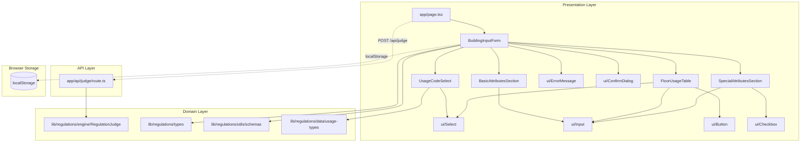
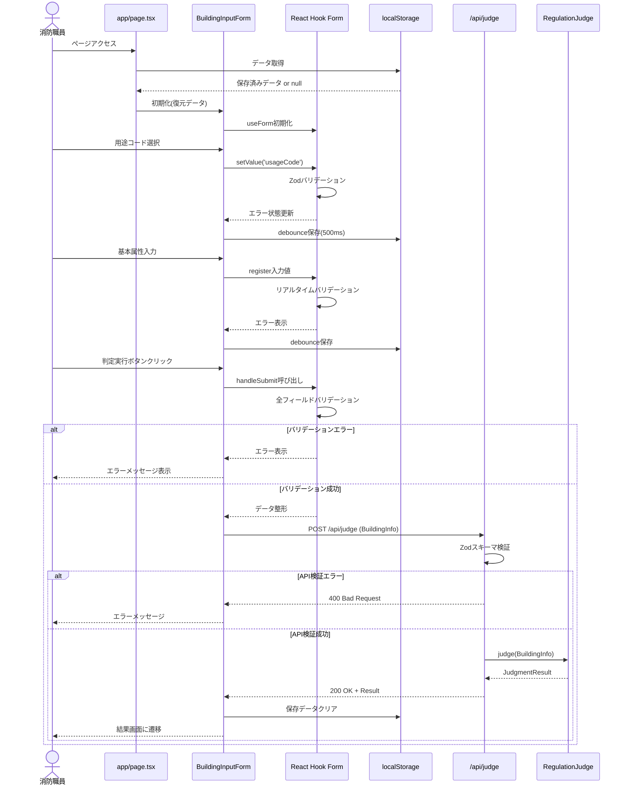

# Technical Design Document: building-input-ui

## Overview

**目的**: 消防用設備規制判別システムの建築物情報入力UIを提供し、消防職員が用途・面積・階数等の情報を型安全に入力できるようにする。入力データは規制判別エンジン(`lib/regulations/engine`)に渡され、必要な消防設備が算出される。

**ユーザー**: 消防職員(査察、事前協議、適合調査、指導文書作成担当者)

**影響**: 現在のプレースホルダーページ(`app/page.tsx`)を建築物情報入力フォームに置き換え、新規APIエンドポイント(`/api/judge`)を追加する。

### Goals

- 47用途コード選択、基本属性入力、階別用途詳細入力、特殊属性入力の4セクションを型安全に実装
- React Hook Form + Zodによるリアルタイムバリデーションで入力ミスを防止
- 複合用途建築物((16)項)の階×用途マトリクス入力に対応
- localStorage自動保存でデータ損失を防止
- 規制判別APIへのフォーム送信と結果画面遷移を実現

### Success Criteria

- 全入力フィールドがTypeScript strict modeで型安全
- バリデーションエラーが100ms以内に表示される
- 階別詳細テーブルに100行追加しても操作遅延なし
- Vitest単体テストカバレッジ80%以上
- Playwright E2Eテストで主要フローを検証

### Non-Goals

- 結果表示画面の実装(別仕様で対応)
- PDF生成機能(別仕様で対応)
- 特殊属性の完全実装(Phase 4で一部実装、残りは将来対応)
- モバイル対応(タブレット・デスクトップのみ)

---

## Architecture

### Existing Architecture Analysis

**現状**:
- `components/`ディレクトリは空(UIコンポーネント未実装)
- `lib/regulations/`にドメインロジック完備(型定義、マスタデータ、規制判別エンジン)
- `lib/regulations/utils/schemas.ts`に基本的なZodスキーマあり(階別詳細・特殊属性は未定義)
- `app/page.tsx`はNext.jsデフォルトプレースホルダー

**既存パターン**:
- ドメイン駆動レイヤー構造: UI層とドメイン層を分離
- TypeScript strict mode + `noUncheckedIndexedAccess`
- 絶対パスインポート(`@/`)使用
- PascalCase コンポーネント命名

**統合ポイント**:
- `lib/regulations/types/BuildingInfo` - フォームデータ型
- `lib/regulations/data/usage-types.USAGE_TYPES` - 用途マスタデータ
- `lib/regulations/utils/schemas` - Zodスキーマ拡張箇所
- `lib/regulations/engine/RegulationJudge` - API Routeから呼び出し

### Architecture Pattern & Boundary Map

**選択パターン**: **セクション分割アーキテクチャ** (Layered + Feature-based Composition)

**理由**: 
- 単一フォームコンポーネントは肥大化リスクが高い(8要件、50+属性)
- セクション分割により単一責任原則を維持し、並行実装を可能にする
- React Hook Formの`control`をpropsで共有することで状態を一元管理



**ドメイン境界**:
- **Presentation Boundary**: UI層(`components/`)はドメイン層(`lib/regulations/`)に依存するが、逆は依存しない
- **API Boundary**: API Route(`app/api/`)はドメイン層を呼び出すが、UI層には依存しない
- **Storage Boundary**: localStorage統合はPresentation層の責務(ドメインロジックは関与しない)

**既存パターン保持**:
- ドメイン独立性: `lib/regulations/`はReact非依存の純粋TypeScript
- パスエイリアス: `@/lib/regulations/types`形式の絶対パス
- 型安全: `BuildingInfo`, `UsageCode`, `FloorUsageDetail`型の厳格利用

**新規コンポーネント理由**:
- **`BuildingInputForm`**: フォーム全体のオーケストレーション、React Hook Form管理、送信処理
- **セクションコンポーネント**: 機能単位の責任分離、テスト容易性、並行実装可能
- **`ui/`プリミティブ**: 再利用可能なデザインシステム、Tailwind CSS統合

**ステアリング準拠**:
- ドメイン駆動レイヤー構造維持(`.kiro/steering/structure.md`)
- TypeScript strict mode準拠(`.kiro/steering/tech.md`)
- コンポーネント命名規約(PascalCase)準拠

### Technology Stack

#### Frontend

- **UI Framework**: React 19.2.0 (Next.js 16.0.1同梱)
- **Form Management**: React Hook Form 7.66.0
  - 役割: フォーム状態管理、バリデーション統合、動的配列管理(`useFieldArray`)
- **Validation**: Zod 4.1.12 + @hookform/resolvers 5.2.2
  - 役割: スキーマベースバリデーション、TypeScript型推論、エラーメッセージ日本語化
- **Styling**: Tailwind CSS 4
  - 役割: ユーティリティファーストCSS、レスポンシブデザイン
- **Icons**: lucide-react 0.553.0
  - 役割: UI操作ボタンのアイコン(Plus, Trash, AlertCircle等)

#### Backend (API Route)

- **Framework**: Next.js 16.0.1 App Router
  - 役割: `/api/judge`エンドポイント、サーバーサイドレンダリング
- **Runtime**: Node.js 20+
  - 役割: API Route実行環境

#### Storage

- **Browser Storage**: localStorage (Web Storage API)
  - 役割: フォーム入力内容の自動保存、ページリロード時の復元

#### Testing

- **Unit Testing**: Vitest 4.0.8 + @testing-library/react 16.3.0
  - 役割: コンポーネント単体テスト、バリデーションロジックテスト
- **E2E Testing**: Playwright 1.56.1
  - 役割: フォーム入力→送信→遷移の統合テスト

**アーキテクチャパターン選択との関連**:
- React Hook Formによるフォーム状態の一元管理がセクション分割を可能にする
- `control` propsの共有により、セクション間で状態を同期
- Zodスキーマの段階的拡張により、実装フェーズごとのバリデーション追加が容易

---

## System Flows

### Sequence Diagram: フォーム入力から判定結果取得まで



### Process Flow: 複合用途モード切り替え

```mermaid
flowchart TD
    Start([用途コード選択]) --> Check{選択値が16系?}
    Check -->|No 単一用途| BasicOnly[基本属性のみ表示]
    Check -->|Yes 複合用途| ShowTable[階別詳細テーブル表示]
    
    BasicOnly --> Validate[基本属性バリデーション]
    ShowTable --> TableInput[階×用途入力]
    TableInput --> AutoCalc[用途別床面積合計を自動計算]
    AutoCalc --> Validate
    
    Validate --> Submit{判定実行?}
    Submit -->|No| Save[localStorage保存]
    Save --> Start
    Submit -->|Yes| APICall[/api/judge呼び出し]
    APICall --> End([結果画面遷移])
```

---

## Requirements Traceability

| Requirement | 要約 | 実現コンポーネント | インターフェース | フロー参照 |
|-------------|------|------------------|----------------|----------|
| **Req 1** | 用途コード選択 | `UsageCodeSelect` | `UsageCodeSelectProps` | Sequence図: 用途コード選択 |
| **Req 2** | 基本属性入力 | `BasicAttributesSection` | `BasicAttributesSectionProps` | Sequence図: 基本属性入力 |
| **Req 3** | 階別用途詳細 | `FloorUsageTable` | `FloorUsageTableProps` | Process図: 複合用途切り替え |
| **Req 4** | 特殊属性入力 | `SpecialAttributesSection` | `SpecialAttributesSectionProps` | - |
| **Req 5** | バリデーション | `BuildingInputForm` + Zod | `buildingInfoFormSchema` | Sequence図: バリデーション |
| **Req 6** | フォーム送信 | `BuildingInputForm` + `/api/judge` | `POST /api/judge` | Sequence図: API呼び出し |
| **Req 7** | UIデザイン | `ui/*` コンポーネント | Tailwind CSS クラス | - |
| **Req 8** | データ永続化 | `useLocalStorageForm` カスタムフック | localStorage API | Sequence図: Storage保存 |

---

## Components and Interfaces

### Presentation Layer

#### BuildingInputForm

**Responsibility & Boundaries**
- **Primary Responsibility**: フォーム全体のオーケストレーション、React Hook Form管理、API送信
- **Domain Boundary**: Presentation層のルートコンポーネント
- **Data Ownership**: フォーム状態(React Hook Form `control`)、送信状態(loading, error)
- **Transaction Boundary**: フォーム送信の開始から完了まで

**Dependencies**
- **Inbound**: `app/page.tsx`から呼び出される
- **Outbound**: 
  - セクションコンポーネント(`UsageCodeSelect`, `BasicAttributesSection`等)
  - `ui/`プリミティブ(`Button`, `ErrorMessage`, `ConfirmDialog`)
  - `lib/regulations/utils/schemas` (Zodスキーマ)
  - `lib/regulations/types` (TypeScript型定義)
- **External**: `/api/judge` (fetch API)、localStorage

**Contract Definition**

**Component Interface**:
```typescript
interface BuildingInputFormProps {
  // 初期データ(復元用)
  initialData?: Partial<BuildingInfo>;
  // 送信成功時のコールバック
  onSubmitSuccess?: (result: JudgmentResult) => void;
  // 送信エラー時のコールバック
  onSubmitError?: (error: Error) => void;
}

interface BuildingInputFormState {
  isLoading: boolean;
  submitError: string | null;
}
```

**Exported Hooks**:
```typescript
// カスタムフック(localStorage統合)
function useLocalStorageForm(
  key: string,
  defaultValues: Partial<BuildingInfo>
): {
  savedData: Partial<BuildingInfo> | null;
  saveData: (data: Partial<BuildingInfo>) => void;
  clearData: () => void;
}
```

**State Management**:
- **State Model**: 
  - `idle`: 初期状態
  - `editing`: ユーザー入力中
  - `validating`: バリデーション実行中
  - `submitting`: API送信中
  - `success`: 送信成功
  - `error`: 送信エラー
- **Persistence**: React Hook Form内部状態 + localStorage
- **Concurrency**: 送信中は再送信ボタンを非活性化

---

#### UsageCodeSelect

**Responsibility & Boundaries**
- **Primary Responsibility**: 47用途コードの選択UI、カテゴリ別グループ化表示
- **Domain Boundary**: 用途選択セクション
- **Data Ownership**: 選択された用途コード(`UsageCode`型)

**Dependencies**
- **Inbound**: `BuildingInputForm`から呼び出し
- **Outbound**: 
  - `ui/Select` (ドロップダウンUI)
  - `lib/regulations/data/usage-types.USAGE_TYPES` (用途マスタ)
- **External**: なし

**Contract Definition**:
```typescript
interface UsageCodeSelectProps {
  control: Control<BuildingInfo>; // React Hook Form control
  name: 'usageCode'; // フィールド名
  error?: FieldError; // バリデーションエラー
  onChange?: (value: UsageCode) => void; // 選択変更時コールバック
}

// 内部ヘルパー型
interface UsageCodeGroup {
  category: string; // "(一)項", "(二)項"等
  options: Array<{
    code: UsageCode;
    label: string; // "劇場、映画館、演芸場又は観覧場"
  }>;
}
```

**Preconditions**: `USAGE_TYPES`マスタデータが存在する  
**Postconditions**: 選択された用途コードがReact Hook Formに登録される  
**Invariants**: 選択値は必ず`UsageCode`リテラル型のいずれか

---

#### BasicAttributesSection

**Responsibility & Boundaries**
- **Primary Responsibility**: 基本属性(延床面積、階数、地階数)の入力UI
- **Domain Boundary**: 基本属性入力セクション
- **Data Ownership**: `totalArea`, `floors`, `undergroundFloors`フィールド

**Dependencies**
- **Inbound**: `BuildingInputForm`から呼び出し
- **Outbound**: `ui/Input` (数値入力フィールド)
- **External**: なし

**Contract Definition**:
```typescript
interface BasicAttributesSectionProps {
  control: Control<BuildingInfo>;
  errors: FieldErrors<BuildingInfo>; // バリデーションエラー
}
```

**Validation Rules** (Zodスキーマで実施):
- `totalArea`: 正の数、最大1,000,000㎡、小数第2位まで
- `floors`: 正の整数、最大200階
- `undergroundFloors`: 0以上の整数、最大20階

---

#### FloorUsageTable

**Responsibility & Boundaries**
- **Primary Responsibility**: 階別用途詳細(`FloorUsageDetail[]`)の動的テーブル入力
- **Domain Boundary**: 階別詳細入力セクション(複合用途時のみ表示)
- **Data Ownership**: `floorUsageDetails`配列、用途別床面積合計(計算値)

**Dependencies**
- **Inbound**: `BuildingInputForm`から条件付き呼び出し(`usageCode`が16系の場合)
- **Outbound**: 
  - `ui/Input`, `ui/Select`, `ui/Button`, `ui/Checkbox`
  - React Hook Form `useFieldArray`
  - `lib/regulations/data/usage-types.USAGE_TYPES`
- **External**: なし

**Contract Definition**:
```typescript
interface FloorUsageTableProps {
  control: Control<BuildingInfo>;
  errors: FieldErrors<BuildingInfo>;
}

interface FloorUsageDetail {
  floor: number; // 階数(地階は負の数)
  usageCode: UsageCode; // 用途コード
  area: number; // 床面積(㎡)
  capacity?: number; // 収容人員
  isWindowless?: boolean; // 無窓階
  isEvacuationFloor?: boolean; // 避難階
  directStairCount?: number; // 直通階段数
  hasEffectiveOutdoorStair?: boolean; // 有効屋外階段
  hasFirewallSeparation?: boolean; // 防火壁区画
}
```

**Dynamic Operations**:
- `append()`: 行追加
- `remove(index)`: 行削除
- `insert(index, value)`: 行挿入

**Auto-calculation**:
```typescript
// 用途別床面積合計を自動計算
function calculateUsageSummary(
  details: FloorUsageDetail[]
): Map<UsageCode, number>;
```

**Performance Optimization**:
- `useMemo`で集計計算をメモ化(100行対応)

---

#### SpecialAttributesSection

**Responsibility & Boundaries**
- **Primary Responsibility**: 特殊属性(無窓階、避難階、階段数等)の入力UI
- **Domain Boundary**: 特殊属性入力セクション
- **Data Ownership**: `isWindowless`, `isEvacuationFloor`, `directStairCount`等

**Dependencies**
- **Inbound**: `BuildingInputForm`から呼び出し
- **Outbound**: `ui/Checkbox`, `ui/Input`
- **External**: なし

**Contract Definition**:
```typescript
interface SpecialAttributesSectionProps {
  control: Control<BuildingInfo>;
  errors: FieldErrors<BuildingInfo>;
  floors: number; // 階数(3階以上で直通階段数表示)
}
```

**Conditional Rendering**:
- `floors >= 3`: `directStairCount`フィールド表示
- それ以外: 非表示

---

### UI Primitives Layer

#### Input

**Contract Definition**:
```typescript
interface InputProps {
  label: string; // フィールドラベル
  type: 'text' | 'number' | 'email'; // input type
  unit?: string; // 単位("㎡", "階"等)
  error?: string; // エラーメッセージ
  helpText?: string; // 補足説明
  ...RegisterOptions; // React Hook Form register props
}
```

**Styling**: Tailwind CSS、エラー時は赤枠表示

---

#### Select

**Contract Definition**:
```typescript
interface SelectProps<T> {
  label: string;
  options: SelectOption<T>[]; // 選択肢
  groups?: SelectOptionGroup<T>[]; // グループ化選択肢
  error?: string;
  ...RegisterOptions;
}

interface SelectOption<T> {
  value: T;
  label: string;
}

interface SelectOptionGroup<T> {
  label: string; // グループ名
  options: SelectOption<T>[];
}
```

---

#### Button

**Contract Definition**:
```typescript
interface ButtonProps {
  variant: 'primary' | 'secondary' | 'danger';
  size: 'sm' | 'md' | 'lg';
  icon?: LucideIcon; // lucide-reactアイコン
  isLoading?: boolean; // ローディング表示
  disabled?: boolean;
  onClick?: () => void;
  type?: 'button' | 'submit' | 'reset';
  children: React.ReactNode;
}
```

---

#### ErrorMessage

**Contract Definition**:
```typescript
interface ErrorMessageProps {
  message: string;
  icon?: boolean; // AlertCircleアイコン表示
}
```

**Styling**: 赤文字、`lucide-react/AlertCircle`アイコン

---

#### ConfirmDialog

**Contract Definition**:
```typescript
interface ConfirmDialogProps {
  isOpen: boolean;
  title: string;
  message: string;
  confirmLabel?: string; // デフォルト: "はい"
  cancelLabel?: string; // デフォルト: "いいえ"
  onConfirm: () => void;
  onCancel: () => void;
}
```

**Usage**: 入力内容クリア時の確認ダイアログ

---

### API Layer

#### POST /api/judge

**API Contract**:

| Method | Endpoint | Request | Response | Errors |
|--------|----------|---------|----------|--------|
| POST | `/api/judge` | `BuildingInfo` (JSON) | `JudgmentResult` (JSON) | 400, 422, 500 |

**Request Schema**:
```typescript
// Body: BuildingInfo型(Zodスキーマで検証)
{
  usageCode: UsageCode;
  totalArea: number;
  floors: number;
  undergroundFloors: number;
  floorUsageDetails?: FloorUsageDetail[];
  // ... 他の属性
}
```

**Response Schema** (成功時):
```typescript
{
  building: BuildingInfo;
  requiredEquipment: RequiredEquipment[];
  judgedAt: string; // ISO 8601 timestamp
}
```

**Error Response**:
```typescript
{
  error: string; // エラーメッセージ
  details?: Record<string, string>; // フィールド別エラー(400時)
}
```

**HTTP Status Codes**:
- `200`: 判定成功
- `400`: バリデーションエラー(Zodスキーマ検証失敗)
- `422`: ビジネスロジックエラー(規制判別エンジン実行失敗)
- `500`: サーバーエラー

**External Dependencies**:
- `lib/regulations/engine/RegulationJudge`: 規制判別エンジン
- `lib/regulations/utils/schemas`: Zodスキーマ

**Implementation Pattern** (Next.js 16 App Router):
```typescript
// app/api/judge/route.ts
export async function POST(request: Request): Promise<Response> {
  // 1. リクエストボディをパース
  const body = await request.json();
  
  // 2. Zodスキーマで検証
  const validationResult = buildingInfoSchema.safeParse(body);
  if (!validationResult.success) {
    return NextResponse.json(
      { error: 'Validation failed', details: validationResult.error.flatten() },
      { status: 400 }
    );
  }
  
  // 3. RegulationJudgeで判定実行
  try {
    const judge = new RegulationJudge();
    const result = judge.judgeRequiredEquipment(validationResult.data);
    return NextResponse.json(result, { status: 200 });
  } catch (error) {
    return NextResponse.json(
      { error: 'Judgment execution failed' },
      { status: 422 }
    );
  }
}
```

**Idempotency**: 同一リクエストの複数回送信は同じ結果を返す(副作用なし)

---

## Data Models

### Logical Data Model

**BuildingInfo** (既存型拡張):
```typescript
interface BuildingInfo {
  // 基本属性(Phase 1)
  usageCode: UsageCode;
  totalArea: number;
  floors: number;
  undergroundFloors: number;
  
  // 階別詳細(Phase 3)
  floorUsageDetails?: FloorUsageDetail[];
  
  // 特殊属性(Phase 4 - 一部実装)
  isWindowless?: boolean;
  isEvacuationFloor?: boolean;
  directStairCount?: number;
  hasEffectiveOutdoorStair?: boolean;
  hasFirewallSeparation?: boolean;
  
  // 将来拡張
  // capacity, height, structureType等
}
```

**FloorUsageDetail**:
```typescript
interface FloorUsageDetail {
  floor: number; // 階数(地階は負の数: -1, -2, ...)
  usageCode: UsageCode; // 用途コード
  area: number; // 床面積(㎡)
  capacity?: number; // 収容人員
  
  // 階全体の属性(同一階の複数用途で共通)
  isWindowless?: boolean;
  isEvacuationFloor?: boolean;
  directStairCount?: number;
  hasEffectiveOutdoorStair?: boolean;
  hasFirewallSeparation?: boolean;
}
```

### Data Contracts & Integration

**Zod Schema Definition** (`lib/regulations/utils/schemas.ts`に追加):

```typescript
// 階別詳細スキーマ
const floorUsageDetailSchema = z.object({
  floor: z.number().int(),
  usageCode: usageCodeSchema,
  area: z.number().positive().max(100000),
  capacity: z.number().int().nonnegative().optional(),
  isWindowless: z.boolean().optional(),
  isEvacuationFloor: z.boolean().optional(),
  directStairCount: z.number().int().nonnegative().max(10).optional(),
  hasEffectiveOutdoorStair: z.boolean().optional(),
  hasFirewallSeparation: z.boolean().optional(),
});

// 包括的なフォームスキーマ
export const buildingInfoFormSchemaExtended = z.object({
  usageCode: usageCodeSchema,
  totalArea: z.number().positive().max(1000000),
  floors: z.number().int().positive().max(200),
  undergroundFloors: z.number().int().nonnegative().max(20),
  floorUsageDetails: z.array(floorUsageDetailSchema).optional(),
  isWindowless: z.boolean().optional(),
  isEvacuationFloor: z.boolean().optional(),
  directStairCount: z.number().int().nonnegative().max(10).optional(),
  hasEffectiveOutdoorStair: z.boolean().optional(),
  hasFirewallSeparation: z.boolean().optional(),
}).refine(
  (data) => {
    // 複合用途の場合はfloorUsageDetails必須
    if (data.usageCode.startsWith('16')) {
      return data.floorUsageDetails && data.floorUsageDetails.length > 0;
    }
    return true;
  },
  {
    message: '複合用途建築物の場合、階別用途詳細の入力が必要です',
    path: ['floorUsageDetails'],
  }
);
```

**Schema Versioning Strategy**: 
- Phase 1: 基本属性のみ
- Phase 3: `floorUsageDetails`追加
- Phase 4: 特殊属性追加
- 将来: `BuildingInfo`型の全属性対応

**Validation Rules**:
- クライアント側: React Hook Form + Zodでリアルタイムバリデーション
- サーバー側: API Routeで同一Zodスキーマを再検証(二重検証)

---

## Error Handling

### Error Strategy

**レイヤー別エラーハンドリング**:

1. **UI Layer** (React Hook Form):
   - Zodバリデーションエラー → フィールド下部に赤文字表示
   - `formState.errors`を`ErrorMessage`コンポーネントで表示

2. **API Layer** (`/api/judge`):
   - リクエストバリデーションエラー(400) → クライアントにJSON返却
   - ビジネスロジックエラー(422) → エラーメッセージ返却
   - サーバーエラー(500) → 一般的なエラーメッセージ

3. **Client Network Layer** (fetch):
   - ネットワークエラー → "通信エラーが発生しました"表示
   - タイムアウト → リトライ提案

### Error Categories and Responses

**User Errors (4xx)**:
- **バリデーションエラー**: フィールド単位でエラーメッセージ表示
  - 例: "延床面積は正の数である必要があります"
- **必須フィールド未入力**: "必須項目です"
- **範囲外の値**: "階数は200階以下である必要があります"

**System Errors (5xx)**:
- **API実行エラー**: "判定処理中にエラーが発生しました。時間をおいて再度お試しください。"
- **ネットワークエラー**: "通信エラーが発生しました。インターネット接続を確認してください。"

**Business Logic Errors (422)**:
- **規制判別エラー**: "建築物情報に基づく規制判別に失敗しました。入力内容を確認してください。"

### Error Display Pattern

```typescript
// ErrorMessage コンポーネント使用例
{errors.totalArea && (
  <ErrorMessage 
    message={errors.totalArea.message} 
    icon={true}
  />
)}

// API エラー表示
{submitError && (
  <div className="rounded-md bg-red-50 p-4">
    <div className="flex">
      <AlertCircle className="h-5 w-5 text-red-400" />
      <div className="ml-3">
        <h3 className="text-sm font-medium text-red-800">
          エラーが発生しました
        </h3>
        <div className="mt-2 text-sm text-red-700">
          {submitError}
        </div>
      </div>
    </div>
  </div>
)}
```

### Monitoring

**Error Logging**:
- クライアント側: `console.error`でブラウザコンソールに記録
- サーバー側: API Routeで`console.error`、将来的に外部ログサービス統合

**Health Monitoring**:
- API Routeのレスポンスタイム計測(将来対応)
- エラー発生率の監視(将来対応)

---

## Testing Strategy

### Unit Tests (Vitest + @testing-library/react)

**対象コンポーネント**:
1. `UsageCodeSelect`: 用途コード選択、グループ化表示、複合用途検出
2. `BasicAttributesSection`: 数値入力、バリデーションエラー表示
3. `FloorUsageTable`: 行追加/削除、自動計算ロジック
4. `ui/Input`: エラー表示、単位表示
5. `ui/Select`: グループ化オプション表示

**テスト例**:
```typescript
describe('UsageCodeSelect', () => {
  it('should group usage codes by category', () => {
    // カテゴリ別グループ化のテスト
  });
  
  it('should call onChange when usage code is selected', () => {
    // 選択時コールバックのテスト
  });
});

describe('FloorUsageTable', () => {
  it('should calculate usage summary correctly', () => {
    // 用途別床面積合計の自動計算テスト
  });
  
  it('should add new row when append button is clicked', () => {
    // 行追加のテスト
  });
});
```

### Integration Tests (Vitest)

**対象フロー**:
1. `BuildingInputForm` + Zodスキーマ統合
2. localStorage自動保存・復元
3. 複合用途モード切り替え

**テスト例**:
```typescript
describe('BuildingInputForm Integration', () => {
  it('should save form data to localStorage on input change', async () => {
    // localStorage保存のテスト
  });
  
  it('should restore form data from localStorage on mount', () => {
    // localStorage復元のテスト
  });
  
  it('should show FloorUsageTable when complex usage is selected', () => {
    // 複合用途モード切り替えのテスト
  });
});
```

### E2E Tests (Playwright)

**Critical User Paths**:
1. 単一用途建築物の入力→判定実行
2. 複合用途建築物の階別詳細入力→判定実行
3. バリデーションエラー表示→修正→送信成功
4. localStorage自動保存→ページリロード→データ復元
5. 入力内容クリア(確認ダイアログ)

**テスト例**:
```typescript
test('should complete single usage building input flow', async ({ page }) => {
  await page.goto('/');
  
  // 用途コード選択
  await page.selectOption('[name="usageCode"]', '6-ro-1');
  
  // 基本属性入力
  await page.fill('[name="totalArea"]', '1000');
  await page.fill('[name="floors"]', '3');
  await page.fill('[name="undergroundFloors"]', '0');
  
  // 判定実行
  await page.click('button[type="submit"]');
  
  // 結果画面遷移確認
  await expect(page).toHaveURL(/\/result/);
});
```

### Performance Tests

**対象**:
1. 階別詳細テーブル100行追加時の操作遅延測定
2. バリデーション実行時間(100ms以内)
3. localStorage保存時間

**測定方法**:
- Vitest の `performance.now()`で時間計測
- Playwrightの`page.evaluate()`でクライアント側パフォーマンス測定

---

## Security Considerations

### Input Validation

**二重検証**:
- クライアント側: React Hook Form + Zodでリアルタイムバリデーション
- サーバー側: API Routeで同一Zodスキーマを再検証

**XSS対策**:
- React のデフォルトエスケープ機能に依存
- `dangerouslySetInnerHTML`は使用しない

### localStorage Security

**データ保存ポリシー**:
- 個人情報・機密情報は保存しない(建築物属性のみ)
- XSS脆弱性がある場合のデータ流出リスクを考慮

**容量制限**:
- 5MB上限、建築物情報は通常10-50KB程度で問題なし

### API Security

**CSRF対策**:
- Next.js 16 App Routerのデフォルト対策に依存
- 将来的にCSRFトークン導入を検討

**Rate Limiting**:
- 初期実装では未対応
- 将来的にAPI Gatewayレベルでレート制限実装

---

## Performance & Scalability

### Target Metrics

- **バリデーション応答時間**: 100ms以内
- **階別詳細テーブル**: 100行追加時も操作遅延なし
- **localStorage保存**: 50ms以内
- **API応答時間**: 2秒以内(規制判別エンジン実行含む)

### Optimization Techniques

**React Hook Form**:
- `mode: 'onBlur'`でフォーカスアウト時のみバリデーション(onChange時は実行しない)
- `shouldUnregister: false`で不要な再レンダリング抑制

**useMemo/useCallback**:
- 用途別床面積合計の自動計算を`useMemo`でメモ化
- イベントハンドラーを`useCallback`でメモ化

**localStorage Debounce**:
- `lodash.debounce`または`useMemo`で500ms debounce処理

**Virtual Scrolling** (将来対応):
- 100行を超える場合は`react-window`で仮想スクロール導入

### Scaling Approach

**Horizontal Scaling**:
- Next.js SSG/SSRでCDN配信可能
- API Routeは無状態でスケーラブル

**Caching**:
- `USAGE_TYPES`マスタデータは静的importでバンドル
- API Routeのレスポンスはキャッシュしない(リアルタイム判定のため)

---

_generated_at: 2025-11-09_
